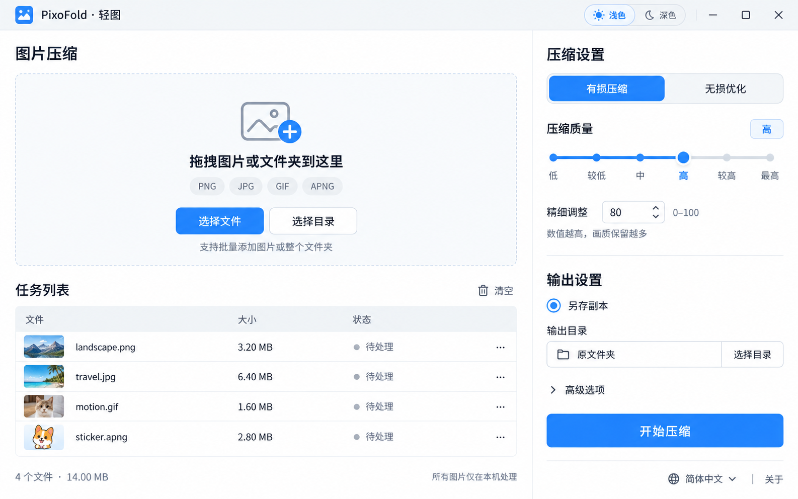
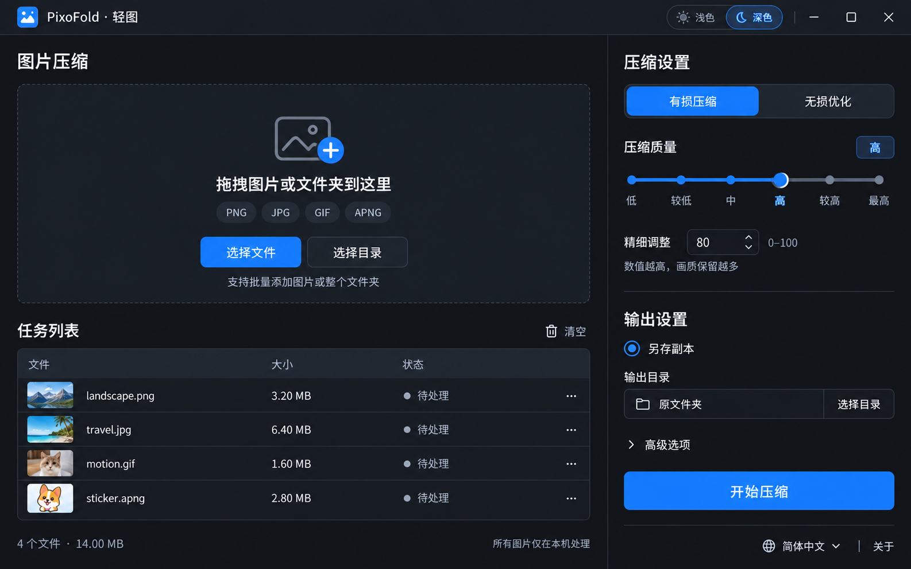

# PixoFold（轻图）UI 界面设计

本目录提供参考 png-palettes 布局、结合最新项目方案生成的亮暗主题设计图、PixoFold logo，以及可继续修改的 HTML 交互原型。两张主题图由内置 image_gen 模型生成，圆角 logo 根据生图原稿使用 SVG 复刻。

直接打开 [PixoFold.html](PixoFold.html) 即可体验界面；运行方式、已实现交互与代码修改入口见 [HTML 原型说明](HTML原型说明.md)。原型中的压缩进度与结果为演示数据，不执行真实压缩或文件写入。

两张主题图均为 1586×992 PNG，保留最初的六档设计作为视觉参考。当前交互以 HTML 为准：已改为 0–100 连续滑块，移除轨道档位圆点和下方标签，质量描述显示在标题行右侧；输出设置采用「原图覆盖 / 另存副本」切换，默认原图覆盖。

HTML 保留导入后自动模拟的交互，不显示开始按钮。空闲时显示中央识别区及底部操作技巧；导入后在该区域切换为全部图片的明细列表，逐张展示缩略图、压缩前后大小、减少比例和状态。底部切换为汇总，固定显示总数量、总体积、节省量和总进度；列表单独滚动。原设计图中的「导入区下方另设列表」和开始按钮仅作历史参考。

## 设计图

| 文件 | 内容 |
| --- | --- |
| [PixoFold.html](PixoFold.html) | 无需构建的 HTML/CSS/JavaScript 交互原型 |
| [HTML 原型说明](HTML原型说明.md) | 使用方法、交互清单、修改入口与正式工程接入边界 |
| [PixoFold-亮色.png](PixoFold-亮色.png) | 亮色主界面：导入区、四种格式的待处理任务与右侧设置 |
| [PixoFold-暗色.png](PixoFold-暗色.png) | 相同布局和数据的暗色主界面 |
| [参考-png-palettes.png](参考-png-palettes.png) | 用户提供的原项目界面参考 |
| [生图提示词.md](生图提示词.md) | 两次模型调用的完整提示词与参考关系 |
| [logo/PixoFold-logo.svg](logo/PixoFold-logo.svg) | PixoFold 圆角矢量 logo，采用蓝白配色与图片折角 |
| [logo/PixoFold-logo-圆角.png](logo/PixoFold-logo-圆角.png) | 从 SVG 渲染的透明 PNG 预览 |
| [logo/PixoFold-logo.png](logo/PixoFold-logo.png) | 新 logo 的生图原稿，保留为矢量复刻参考 |
| [Logo 设计说明](logo/README.md) | 新 logo 的设计元素、参考文件与完整生图提示词 |

## 已确定的界面规则

- 产品名称为 **PixoFold · 轻图**，整体保持左侧工作区、右侧设置栏。
- 左侧以中央识别区为主；拖入、选择文件和选择目录共用自动处理流程，支持递归识别子目录。首次打开为空状态，可在「关于 → 导入示例并模拟」中体验演示。
- 导入后的图片列表在等待参数修正、模拟中及结束后持续显示；处理中可逐张查看结果，结束后可清除结果、重试未完成文件或直接导入下一批。
- 底部区域桌面端至少约 170 CSS px，不随图片列表滚动。无有效图片时显示批量导入、参数设置及快捷操作技巧，隐藏统计与进度；有图片时显示文件总数、原始总体积、当前总体积、已节省空间和比例、各状态数量及总进度条。仅已完成文件计入节省量；完成或取消后保留汇总，清除后恢复技巧，切换时桌面端区域高度保持一致。
- 支持亮色和暗色；导入、队列、参数与主按钮在两种主题中保持同一位置。
- PNG、JPEG、GIF、APNG 共用 **0–100 连续质量滑块**，按整数逐值调整，不吸附到六个预设值。
- 滑块和下方精细输入默认均为 **80**，双向同步实际数值。
- 仅在「压缩质量」标题行右侧显示当前描述 **低、较低、中、高、较高、最高** 中的一项；使用无边框、无背景的纯文字，轨道不显示档位圆点或标签。
- 默认有损压缩、原图覆盖；无损模式保留质量区布局但禁用有损参数，高级选项默认折叠。
- 输出设置使用与压缩模式相同的分段切换样式；仅选择「另存副本」时显示原有的输出目录标签、原文件夹与选择目录控件。切回原图覆盖时收起目录设置，再次选择另存副本时恢复之前的目录。
- 图中四个文件及大小是设计样例，均处于待处理状态，不代表实际压缩结果。

交互状态、输入边界、格式映射与亮暗主题变量以 [UI 交互与质量映射设计](../架构设计文档/ui-interaction-design.md) 为准；总体目标与实施阶段见 [项目方案](../架构设计文档/pixofold-proposal.md)。

## 亮色预览

## 暗色预览

